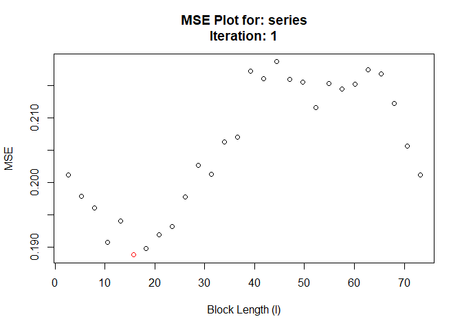
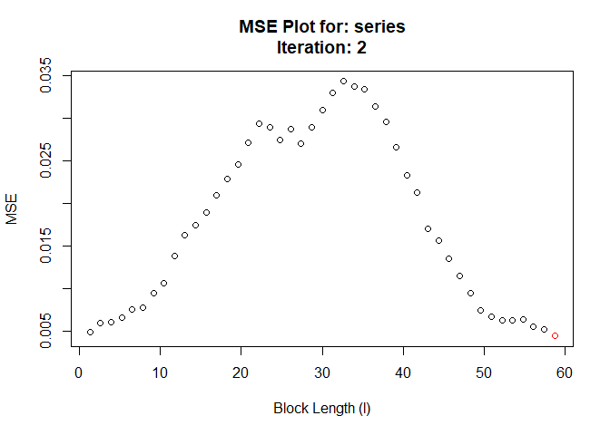

<!-- README.md is generated from README.Rmd. Please edit that file -->

# hhjboot

<!-- badges: start -->

[](https://github.com/Alec-Stashevsky/hhjboot/actions)
[](https://www.gnu.org/licenses/old-licenses/gpl-2.0.en.html)
[](https://codecov.io/gh/Alec-Stashevsky/hhjboot?branch=main)
<!-- badges: end -->

Regular bootstrap methods rely on assumptions that observations are
independent and identically distributed (*i.i.d.*), but this assumption
fails for many types of time series because we would expect the
observation in the previous period to have some explanatory power over
the current observation. This could occur in any time series from
unemployment rates, stock prices, biological data, etc. A time series
that is *i.i.d.* would look like white noise, since the following
observation would be totally independent of the previous one.

To get around this problem, we can retain some of this *time-dependence*
by breaking-up a time series into a number of blocks with length *l*.
Instead of sampling each observation randomly (with replacement) like a
regular bootstrap, we can resample these *blocks* at random. This way
within each block the time-dependence is preserved.

The problem with the block bootstrap is the high sensitivity to the
choice of block-length, or the number of blocks to break the time series
into.

The goal of `hhjboot` is to simplify and automate the process of
selecting a block-length to perform a block bootstrap. `hhjboot` takes
its name from the [Hall, Horowitz, and Jing
(1995)](https://academic.oup.com/biomet/article-abstract/82/3/561/260651?redirectedFrom=fulltext)
method to algorithmically select the optimal block-length for a given
stationary time series.

Under the hood, `hhjboot` uses the moving block bootstrap (MBB)
procedure according to [Künsch
(1989)](https://projecteuclid.org/euclid.aos/1176347265) which resamples
blocks from a set of overlapping sub-samples with a fixed block-length.
However, the results of `hhjboot` may be generalized to other block
bootstrap procedures such as the *stationary bootstrap* of [Politis and
Romano
(1994).](https://www.tandfonline.com/doi/abs/10.1080/01621459.1994.10476870)

## Installation

<!-- You can install the released version of hhjboot from [CRAN](https://CRAN.R-project.org) with: -->
<!-- ``` r -->
<!-- install.packages("hhjboot") -->
<!-- ``` -->

Install the development version from [GitHub](https://github.com) with:

``` r
# install.packages("devtools")
devtools::install_github("Alec-Stashevsky/hhjboot")
```

## Upcoming changes

-   change parallel to `{foreach}` (pending feedback)
-   Build tests
    -   Overlapping subsamples cover entire series

## Example

We want to select the optimal block-length to perform a block bootstrap
on a simulated autoregressive *AR(1)* time series:

``` r
library(hhjboot)
set.seed(32)

# Simulate AR(1) time series
series <- stats::arima.sim(model = list(order = c(1, 0, 0), ar = 0.5),
                           n = 500, rand.gen = rnorm)

# Find optimal block length using overlapping subsamples of width 10
hhjboot(series, sub.block.size = 10, verbose = F)
#> Registered S3 method overwritten by 'quantmod':
#>   method            from
#>   as.zoo.data.frame zoo
```



    #> $`Optimal Block Length`
    #> [1] 11
    #> 
    #> $`Subsample block size (m)`
    #> [1] 10
    #> 
    #> $Call
    #> hhjboot(series = series, sub.block.size = 10, verbose = F)
