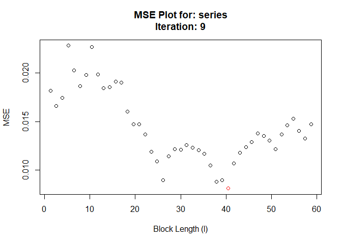
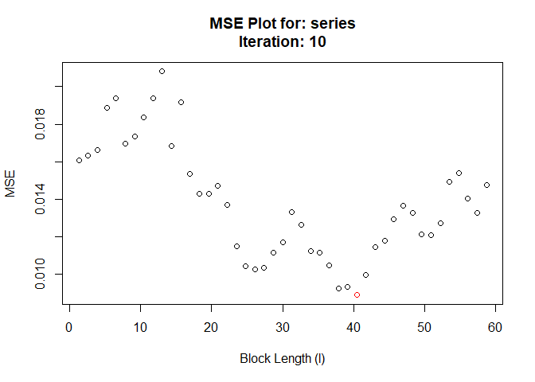

<!-- README.md is generated from README.Rmd. Please edit that file -->

# hhjboot

<!-- badges: start -->

[](https://travis-ci.com/Alec-Stashevsky/hhjboot)
<!-- badges: end -->

The goal of hhjboot is to simplify and automate the process of selecting
a block length to perform a moving block bootstrap (MBB). hhjboot takes
its name from the Hall, Horowitz, and Jing (1995) method to
algorithmically select the optimal block length for the moving block
bootstrap on a given time series.

## Installation

<!-- You can install the released version of hhjboot from [CRAN](https://CRAN.R-project.org) with: -->

<!-- ``` r -->

<!-- install.packages("hhjboot") -->

<!-- ``` -->

And the development version from [GitHub](https://github.com/) with:

``` r
# install.packages("devtools")
devtools::install_github("Alec-Stashevsky/hhjboot")
```

## Notes

  - change parallel package to suggest instead of import and add
    requireNamespace()
  - build test to make sure overlaping subsamples cover entire series

## Example

This is a basic example which shows you how to solve a common problem:

``` r
library(hhjboot)

# Simulate AR(1) time series
series <- stats::arima.sim(model = list(order = c(1, 0, 0), ar = 0.5),
                                     n = 100, innov = rnorm(100))
# Default
hhjboot(series, sub.block.size = 45)
#>  Pilot block length is: 3
#> Registered S3 method overwritten by 'quantmod':
#>   method            from
#>   as.zoo.data.frame zoo
#> Performing minimization may take some time
#> Calculating MSE for each level in subsample: 45 function evaluations required.
#>  Chosen block length: 10  After iteration: 1
```


    #>  Chosen block length: 9  After iteration: 2


    #>  Chosen block length: 10  After iteration: 3


    #>  Chosen block length: 7  After iteration: 4


    #>  Chosen block length: 10  After iteration: 5


    #>  Chosen block length: 8  After iteration: 6


    #>  Chosen block length: 7  After iteration: 7


    #>  Chosen block length: 25  After iteration: 8


    #>  Chosen block length: 40  After iteration: 9



    #>  Converged at block length (l): 40



    #> $`Optimal Block Length`
    #> [1] 40
    #> 
    #> $`Pilot Number of Blocks (m)`
    #> [1] 45
    #> 
    #> $Call
    #> hhjboot(series = series, sub.block.size = 45)
