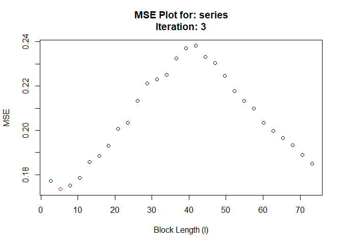
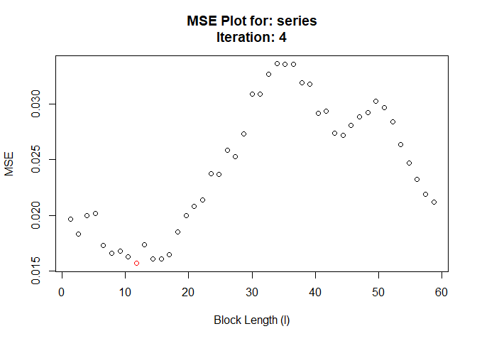
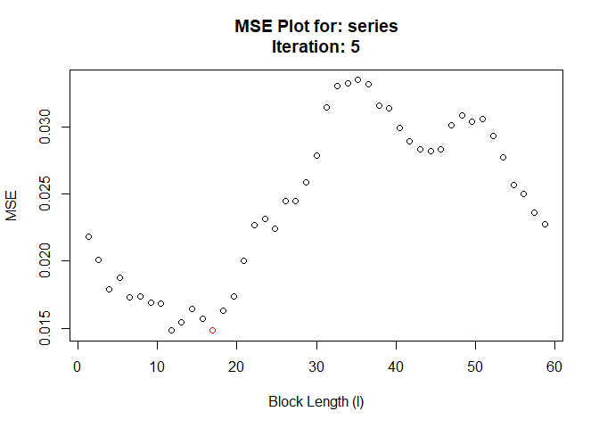
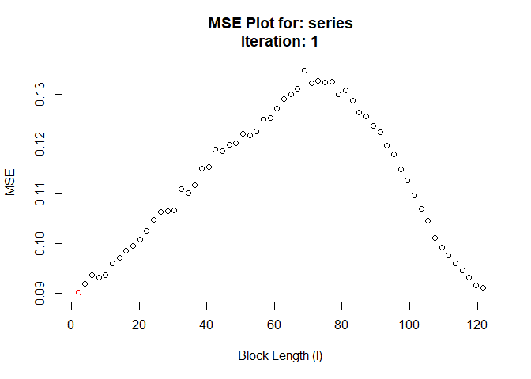
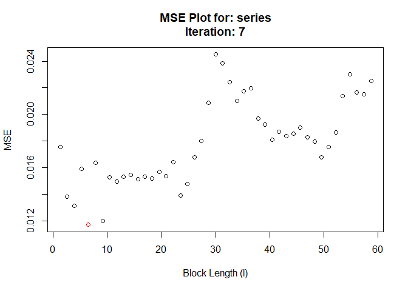
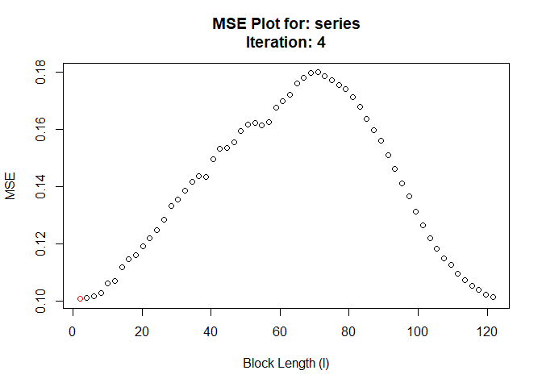

<!-- README.md is generated from README.Rmd. Please edit that file -->

# hhjboot

<!-- badges: start -->

<!-- badges: end -->

The goal of hhjboot is to simplify and automate the process of selecting
a block length to perform a moving block bootstrap (MBB). hhjboot takes
its name from the Hall, Horowitz, and Jing (1995) method to
algorithmically select the optimal block length for the moving block
bootstrap on a given time series.

## Installation

<!-- You can install the released version of hhjboot from [CRAN](https://CRAN.R-project.org) with: -->

<!-- ``` r -->

<!-- install.packages("hhjboot") -->

<!-- ``` -->

And the development version from [GitHub](https://github.com/) with:

``` r
# install.packages("devtools")
devtools::install_github("Alec-Stashevsky/hhjboot")
```

## Example

This is a basic example which shows you how to solve a common problem:

``` r
library(hhjboot)

# Create AR(1) time series
series <- as.vector(stats::arima.sim(model = list(order = c(1, 0, 0), ar = 0.5),
                                     n = 500, innov = rnorm(500)))
# Default
HHJboot(series)
#>  Pilot block length is: 3
#> Registered S3 method overwritten by 'quantmod':
#>   method            from
#>   as.zoo.data.frame zoo
#> Performing minimization may take some time
#> Calculating MSE for each level in subsample: 28 function evaluations required.
#>  Chosen block length: 10  After iteration: 1
```


    #>  Converged at block length (l): 10


    #> $`Optimal Block Length`
    #> [1] 10
    #> 
    #> $`Pilot Number of Blocks (m)`
    #> [1] 28
    #> 
    #> $Call
    #> HHJboot(series = series)
    
    # With parallel grid-search
    cl <- parallel::makeCluster(parallel::detectCores())
    HHJboot(series, cl = cl)
    #>  Pilot block length is: 3
    #> Performing minimization may take some time
    #> Calculating MSE for each level in subsample: 28 function evaluations required.
    #>  Chosen block length: 8  After iteration: 1



    #>  Converged at block length (l): 8



    #> $`Optimal Block Length`
    #> [1] 8
    #> 
    #> $`Pilot Number of Blocks (m)`
    #> [1] 28
    #> 
    #> $Call
    #> HHJboot(series = series, cl = cl)
    
    # With given pilot block length and size of overlapping subsample
    HHJboot(series, pilot.block.length = 15, sub.block.size = 60)
    #>  Pilot block length is: 15
    #> Performing minimization may take some time
    #> Calculating MSE for each level in subsample: 60 function evaluations required.
    #>  Chosen block length: 2  After iteration: 1



    #>  Chosen block length: 6  After iteration: 2



    #>  Chosen block length: 2  After iteration: 3



    #>  Converged at block length (l): 2



    #> $`Optimal Block Length`
    #> [1] 2
    #> 
    #> $`Pilot Number of Blocks (m)`
    #> [1] 60
    #> 
    #> $Call
    #> HHJboot(series = series, pilot.block.length = 15, sub.block.size = 60)
