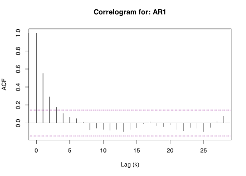

<!-- README.md is generated from README.Rmd. Please edit that file -->

# blocklength 

<!-- badges: start -->

[](https://github.com/Alec-Stashevsky/blocklength/actions/workflows/R-CMD-check.yaml)
[](https://CRAN.R-project.org/package=blocklength)
[](https://CRAN.R-project.org/package=blocklength)
[](https://CRAN.R-project.org/package=blocklength)
[](https://app.codecov.io/gh/Alec-Stashevsky/blocklength)

<!-- badges: end -->

`blocklength` is an R package used to automatically select the
block-length parameter for a block-bootstrap. It is meant for use with
dependent data such as stationary time series.

## The Story

Regular bootstrap methods rely on assumptions that observations are
independent and identically distributed (*i.i.d.*), but this assumption
fails for many types of time series because we would expect the
observation in the previous period to have some explanatory power over
the current observation. This could occur in any time series from
unemployment rates, stock prices, biological data, etc. A time series
that is *i.i.d.* would look like white noise, since the following
observation would be totally independent of the previous one (random).

To get around this problem, we can retain some of this *time-dependence*
by breaking-up a time series into a number of blocks with length *l*.
Instead of sampling each observation randomly (with replacement) like a
regular bootstrap, we can resample these *blocks* at random. This way
within each block the time-dependence is preserved.

The problem with the block bootstrap is the high sensitivity to the
choice of block-length, or the number of blocks to break the time series
into.

The goal of `blocklength` is to simplify and automate the process of
selecting a block-length to perform a bootstrap on dependent data.
`blocklength` has several functions that take their name from the
authors who have proposed them. Currently, there are three methods
available:

1.  `hhj()` takes its name from the [Hall, Horowitz, and Jing
    (1995)](https://doi.org/10.1093/biomet/82.3.561) “HHJ” method to
    select the optimal block-length using a cross-validation algorithm
    which minimizes the mean squared error *(MSE)* incurred by the
    bootstrap at various block-lengths.

2.  `pwsd()` takes its name from the [Politis and White
    (2004)](https://doi.org/10.1081/ETC-120028836) Spectral Density
    “PWSD” Plug-in method to automatically select the optimal
    block-length using spectral density estimation via “flat-top” lag
    windows of [Politis and Romano
    (1995).](https://doi.org/10.1111/j.1467-9892.1995.tb00223.x)

3.  `nppi()` takes its name from the [Lahiri, Furukawa, and Lee
    (2007)](https://doi.org/10.1016/j.stamet.2006.08.002) Nonparametric
    Plug-In “NPPI” method to select the optimal block-length for block
    bootstrap procedures. The NPPI method estimates the leading term in
    the first-order expansion of the theoretically optimal block length
    by using resampling methods to construct consistent bias and
    variance estimators for the block-bootstrap. Specifically, this
    package implements the Moving Block Bootstrap (MBB) method of
    [Künsch (1989)](https://doi.org/10.1214/aos/1176347265) and the
    Moving Blocks Jackknife (MBJ) of [Liu and Singh
    (1992)](https://doi.org/10.1214/aos/1176348653) as the bias and
    variance estimators, respectively.

Under the hood, `hhj()` uses the moving block bootstrap (MBB) procedure
according to [Künsch
(1989)](https://projecteuclid.org/euclid.aos/1176347265) which resamples
blocks from a set of overlapping sub-samples with a fixed block-length.
However, the results of `hhj()` may be generalized to other block
bootstrap procedures such as the *stationary bootstrap* of [Politis and
Romano (1994).](https://doi.org/10.1080/01621459.1994.10476870)

Compared to `pwsd()`, `hhj()` is more computationally intensive as it
relies on iterative sub-sampling processes that optimize the MSE
function over each possible block-length (or a select grid of
block-lengths), while `pwsd()` is a simpler “plug-in” rule that uses
auto-correlations, auto-covariance, and the spectral density of the
series to optimize the choice of block-length. Similarly, `nppi()` is
another “plug-in” rule, however, due to its heavy reliance on
resampling, it can also be computationally intensive compared to
`pwsd()`.

For a detailed comparison, see the table below:

|  | NPPI (Lahiri et al., 2007) | PWSD (Politis & White, 2004) | HHJ (Hall, Horowitz & Jing, 1995) |
|:---|:---|:---|:---|
| **Method Type** | Nonparametric resampling | Spectral density estimation | Subsampling-based cross-validation |
| **Computational Cost** | Medium (bootstrap resampling & jackknife) | Low (direct ACF computation) | High (subsampling & cross-validation) |
| **Primary Goal** | Minimize MSE of bootstrap estimator | Estimate block length using spectral density | Minimize MSE via cross-validation |
| **Variance Estimation** | Moving Blocks Jackknife-After-Bootstrap (JAB) | Implicitly estimated via spectral density | Uses subsample-based variance estimation |
| **Bias Estimation** | Directly estimates bias from bootstrap | Indirectly accounts for bias via ACF decay | Uses subsample-based bias estimation |
| **Best for** | General-purpose estimators, small sample sizes, and quantile estimation | Block-length selection for circular and stationary bootstrap, time series with strong autocorrelation | Estimating functionals with strong dependencies |
| **Estimation Capacity** | Bootstrap bias, variance, distribution function, and quantile estimation | Bootstrap sample mean only | Bootstrap variance and distribution function estimation |
| **Dependency\*** | User-defined parameters for initial block-length `l` and number of deletion blocks `m` | User-defined parameters for autocorrelation lag and implied hypothesis tests (4 total) | Requires user-defined parameters for `pilot_block_length` (*l\**) and `sub_sample` size (*m*) |

\* All algorithms have default user-defined parameters recomended by the
respective authors.

## Installation

You can install the released version from
[CRAN](https://cran.r-project.org/package=blocklength) with:

``` r
install.packages("blocklength")
```

You can install the development version from
[GitHub](https://github.com/Alec-Stashevsky/blocklength) with:

``` r
# install.packages("devtools")
devtools::install_github("Alec-Stashevsky/blocklength")
```

## Use Case

We want to select the optimal block-length to perform a block bootstrap
on a simulated autoregressive *AR(1)* time series.

First we will generate the time series:

``` r
library(blocklength)

# Simulate AR(1) time series
series <- stats::arima.sim(model = list(order = c(1, 0, 0), ar = 0.5),
                           n = 500, rand.gen = rnorm)

# Coerce time series to data.frame (not necessary)
data <- data.frame("AR1" = series)
```

Now, we can find the optimal block-length to perform a block-bootstrap.
We do this using the three available methods.

### 1. The Hall, Horowitz, and Jing (1995) “HHJ” Method

``` r
## Using the HHJ Algorithm with overlapping subsamples of width 10
hhj(series, sub_sample = 10, k = "bias/variance")
#>  Pilot block length is: 3
#> Registered S3 method overwritten by 'quantmod':
#>   method            from
#>   as.zoo.data.frame zoo
#> Performing minimization may take some time
#> Calculating MSE for each level in subsample: 10 function evaluations required.
```


    #>  Chosen block length: 11  After iteration: 1


    #>  Converged at block length (l): 11
    #> $`Optimal Block Length`
    #> [1] 11
    #> 
    #> $`Subsample block size (m)`
    #> [1] 10
    #> 
    #> $`MSE Data`
    #>    Iteration BlockLength       MSE
    #> 1          1           4 0.5428141
    #> 2          1           7 0.5159969
    #> 3          1          11 0.5058036
    #> 4          1          15 0.5101443
    #> 5          1          18 0.5173569
    #> 6          1          22 0.5285706
    #> 7          1          26 0.5307042
    #> 8          1          29 0.5459579
    #> 9          1          33 0.5596887
    #> 10         1          37 0.5536393
    #> 11         2           4 0.5404021
    #> 12         2           7 0.5165052
    #> 13         2          11 0.5083257
    #> 14         2          15 0.5096941
    #> 15         2          18 0.5099022
    #> 16         2          22 0.5251345
    #> 17         2          26 0.5297922
    #> 18         2          29 0.5411978
    #> 19         2          33 0.5595094
    #> 20         2          37 0.5541540
    #> 
    #> $Iterations
    #> [1] 2
    #> 
    #> $Series
    #> [1] "series"
    #> 
    #> $Call
    #> hhj(series = series, sub_sample = 10, k = "bias/variance")
    #> 
    #> attr(,"class")
    #> [1] "hhj"

### 2. The Politis and White (2004) Spectral Density Estimation “PWSD” Method

``` r
# Using Politis and White (2004) Spectral Density Estimation
pwsd(data)
```



    #> $BlockLength
    #>     b_Stationary b_Circular
    #> AR1     9.327923   10.67781
    #> 
    #> $Acf
    #> $Acf$AR1
    #> 
    #> Autocorrelations of series 'data[, i]', by lag
    #> 
    #>      0      1      2      3      4      5      6      7      8      9     10 
    #>  1.000  0.550  0.291  0.175  0.107  0.066  0.049  0.010 -0.078 -0.057 -0.071 
    #>     11     12     13     14     15     16     17     18     19     20     21 
    #> -0.081 -0.071 -0.097 -0.073 -0.054 -0.010  0.014 -0.030 -0.042 -0.020 -0.073 
    #>     22     23     24     25     26     27     28 
    #> -0.088 -0.050 -0.058 -0.097 -0.049  0.021  0.078 
    #> 
    #> 
    #> $parameters
    #>        n k        c K_N M_max b_max m_hat M rho_k_critical
    #> [1,] 500 1 1.959964   5    28    68     3 6      0.1439999
    #> 
    #> $Call
    #> pwsd(data = data)
    #> 
    #> attr(,"class")
    #> [1] "pwsd"

We can see that both methods produce similar results for a block-length
of 9 or 11 depending on the type of bootstrap method used.

### 3. The Lahiri, Furukawa, and Lee (2007) Nonparametric Plug-In “NPPI” Method

``` r
# Using Lahiri, Furukawa, and Lee (2007) Nonparametric Plug-In 
nppi(data, m = 8) 
#>  Setting l to recomended value: 3
```


    #> $optimal_block_length
    #> [1] 0.01073025
    #> 
    #> $bias
    #> [1] 0.01152002
    #> 
    #> $variance
    #> [1] 0.0331001
    #> 
    #> $jab_point_values
    #>   [1] -0.0327374132  0.0086065594  0.0025366424  0.0406465091  0.0406465091
    #>   [6]  0.0027838449 -0.0030100569  0.0406465091 -0.0971565707 -0.0371154550
    #>  [11] -0.0755599178 -0.0755599178  0.0339749181 -0.0153968136  0.0145322529
    #>  [16]  0.0169365682 -0.0333963967 -0.0333963967 -0.0333963967  0.0005655976
    #>  [21]  0.0005655976  0.0005655976 -0.0708860990 -0.0270703095 -0.0270703095
    #>  [26] -0.0659660916  0.0105882914 -0.0534955263  0.0206597579  0.0206597579
    #>  [31] -0.0011544990 -0.0011544990  0.0183578992 -0.0301712541  0.0054632495
    #>  [36] -0.0266459338 -0.0054879294  0.0134722464  0.0134722464  0.0449865026
    #>  [41]  0.0449865026  0.0449865026  0.0449865026  0.0449865026  0.0100703950
    #>  [46] -0.0889593545  0.0310801474 -0.0243945020  0.0152544405 -0.0278311082
    #>  [51] -0.0116288527 -0.0320142219 -0.0320142219 -0.0142486081 -0.0052232227
    #>  [56] -0.0052232227 -0.0052232227 -0.0276679506  0.0423320598 -0.0917146684
    #>  [61] -0.0672953105  0.0678550387 -0.0378347310 -0.0378347310 -0.0818476398
    #>  [66] -0.0427210926 -0.0250356679 -0.0250356679  0.0150383573 -0.0180655321
    #>  [71] -0.0011544990 -0.0446551570 -0.0994751979 -0.0994751979 -0.0576207962
    #>  [76] -0.0396419555 -0.0396419555 -0.0396419555 -0.0003119844 -0.0540061018
    #>  [81]  0.0803656842 -0.0528692544 -0.0646321946 -0.0646321946 -0.0402261089
    #>  [86] -0.0208329391 -0.0389210110  0.0489710594 -0.0099764121 -0.0355391996
    #>  [91] -0.0536628938 -0.0378180773  0.0124084253  0.0124084253 -0.0644349773
    #>  [96] -0.0644349773 -0.0644349773 -0.0369211728 -0.0238227629 -0.0238227629
    #> [101]  0.0333384171  0.0333384171  0.0140114628  0.0447980697 -0.1019902258
    #> [106] -0.0428492854 -0.0142220238 -0.1019902258 -0.1019902258 -0.0835156159
    #> [111] -0.0819563010 -0.0819563010 -0.0185758839 -0.0266705165 -0.0144722001
    #> [116] -0.0107257918  0.0487134593  0.0487134593  0.0002546279 -0.0931438608
    #> [121] -0.0011345209 -0.0011345209  0.0375753481  0.0062359912  0.0866643452
    #> [126]  0.0866643452  0.0866643452  0.0246924924 -0.0187366056 -0.0934362236
    #> [131] -0.0603000732 -0.0603000732 -0.0417117852 -0.0074732676 -0.0074732676
    #> 
    #> $jab_pseudo_values
    #>   [1]  0.00000000  0.00000000  0.00000000  0.00000000  0.00000000  0.00000000
    #>   [7]  0.00000000  0.64920441  0.00000000  0.00000000  0.00000000 -1.88311391
    #>  [13] -1.51133149  0.00000000  0.00000000  0.00000000  0.00000000 -3.84556083
    #>  [19] -3.84556083 -1.52647265 -1.17159616 -3.84556083  0.00000000  0.00000000
    #>  [25]  0.00000000  0.00000000  0.00000000  0.00000000  0.00000000  0.00000000
    #>  [31]  0.00000000  0.00000000  0.00000000  4.59487780  0.91735947  0.00000000
    #>  [37]  0.00000000  0.00000000  3.27208282  3.27208282  0.00000000 -3.43692588
    #>  [43] -0.41290732  0.00000000  0.00000000  0.00000000  0.00000000 -2.24606264
    #>  [49] -2.39332695  0.00000000  0.00000000  0.00000000  0.00000000  0.00000000
    #>  [55]  0.00000000  0.00000000  0.00000000  0.00000000  0.68956715  0.68956715
    #>  [61]  0.68956715 -1.39060500 -1.39060500 -1.39060500  0.00000000  0.00000000
    #>  [67]  0.00000000  0.00000000  0.00000000  0.00000000  0.00000000  0.00000000
    #>  [73]  0.00000000  0.00000000  0.00000000  2.98581141  0.30209431  0.30209431
    #>  [79]  0.00000000  0.00000000  2.68446096  0.00000000  0.00000000  0.00000000
    #>  [85]  0.00000000  0.00000000 -2.00449499  0.00000000  0.00000000  0.00000000
    #>  [91]  0.00000000  0.00000000  0.00000000  1.92063884  0.00000000  0.00000000
    #>  [97] -2.62137232 -2.62137232  0.00000000  0.00000000  0.00000000  0.00000000
    #> [103] -1.28524909 -1.28524909 -2.48038348  0.00000000  0.00000000  0.00000000
    #> [109]  0.49202717  0.00000000  0.00000000  0.00000000  0.00000000  0.00000000
    #> [115]  0.00000000  0.00000000  0.00000000  0.00000000  0.00000000 -1.69058618
    #> [121]  0.27610129  0.00000000  0.00000000  0.00000000  0.00000000  0.00000000
    #> [127]  0.00000000  0.00000000 -1.01982647  0.00000000  0.00000000 -2.18113724
    #> [133] -2.18113724  0.00000000 -4.11138543 -4.11138543 -4.11138543 -4.11138543
    #> [139] -4.11138543  0.00000000  0.00000000  0.00000000  0.00000000  0.00000000
    #> [145]  0.00000000  0.00000000 -1.97277384  0.00000000  0.00000000  0.00000000
    #> [151]  0.00000000  0.00000000  0.00000000  4.09279831  0.00000000  0.00000000
    #> [157]  0.00000000  0.00000000  0.00000000  0.00000000  0.00000000  0.00000000
    #> [163]  0.00000000  0.00000000 -3.25962118  0.13820110 -2.29029663  0.00000000
    #> [169]  0.00000000  0.00000000  0.00000000  0.00000000  0.00000000  0.00000000
    #> [175]  0.00000000  0.00000000  0.00000000  0.00000000  0.00000000  0.00000000
    #> [181]  0.00000000  0.00000000  0.00000000  0.00000000  0.00000000  0.00000000
    #> [187]  0.00000000  0.00000000  0.34869323  0.00000000  0.00000000  0.00000000
    #> [193]  0.00000000  0.00000000  0.00000000  0.00000000  0.00000000  0.00000000
    #> [199]  0.00000000 -0.64369492  0.00000000  0.60490894  0.60490894  0.00000000
    #> [205]  0.00000000  0.00000000 -0.48323491  0.00000000 -1.03603976 -1.03603976
    #> [211] -1.03603976  0.00000000  0.00000000  0.00000000  0.33869982 -3.94880081
    #> [217]  0.00000000  4.26156129  0.00000000  0.00000000  2.76587562 -5.51208327
    #> [223]  0.00000000  0.00000000  0.96141512  0.96141512  0.00000000  0.00000000
    #> [229]  0.00000000  0.00000000  0.00000000  0.00000000  0.00000000  0.00000000
    #> [235]  0.00000000  0.00000000  0.00000000  0.00000000  0.00000000  0.00000000
    #> [241]  0.00000000  0.00000000  3.65720579  1.26070477  0.00000000  0.00000000
    #> [247]  0.00000000  0.17747251  0.17747251  0.00000000  0.00000000  0.00000000
    #> [253]  0.00000000  0.00000000  0.00000000  0.00000000  0.00000000  0.00000000
    #> [259]  0.00000000  0.00000000  0.00000000  0.00000000 -2.27706154  0.00000000
    #> [265]  0.00000000  0.00000000  0.00000000  0.00000000  0.00000000  0.00000000
    #> [271]  0.00000000 -0.24944831  0.00000000 -1.28524909  0.00000000  0.00000000
    #> [277]  0.00000000  0.00000000  0.00000000  1.37916621  4.73689372  4.73689372
    #> [283]  0.00000000  0.00000000  0.00000000  2.17331162  0.00000000  1.07210762
    #> [289]  1.07210762  1.07210762  0.00000000 -1.33685310  0.00000000  0.00000000
    #> [295]  0.00000000  0.00000000  0.00000000  0.00000000  0.00000000  0.00000000
    #> [301]  0.00000000  0.00000000  0.00000000  1.95191159 -6.27836030  0.00000000
    #> [307]  0.00000000  0.00000000  0.00000000  0.00000000  0.00000000  0.00000000
    #> [313]  1.88227969  2.60275977  2.60275977  0.00000000  0.00000000  1.10788702
    #> [319]  0.00000000  0.00000000 -0.07994463  1.02794977  0.00000000  0.00000000
    #> [325]  0.00000000  0.00000000  0.00000000  0.00000000 -4.35543954  0.00000000
    #> [331]  0.00000000  0.00000000  0.00000000 -0.74490691  0.00000000  0.00000000
    #> [337]  0.00000000  0.00000000  0.82081383  0.00000000  0.00000000  0.00000000
    #> [343]  0.00000000  0.00000000  0.00000000  0.00000000  0.00000000  0.00000000
    #> [349]  0.00000000  1.93089010  0.00000000  0.00000000  0.00000000  0.00000000
    #> [355]  0.00000000  0.00000000  0.00000000  0.00000000  0.00000000  0.00000000
    #> [361]  0.00000000  0.96039509  0.00000000  0.00000000  0.00000000  0.00000000
    #> [367]  0.00000000  0.00000000 -2.11597820 -2.11597820  0.00000000  0.00000000
    #> [373]  0.00000000  0.00000000  0.00000000  0.00000000  0.00000000  0.00000000
    #> [379]  0.00000000  0.00000000  0.00000000  2.59068021  2.59068021  2.59068021
    #> [385]  0.00000000  0.00000000  0.00000000  0.90545968  0.10318208  0.10318208
    #> [391]  0.00000000  0.00000000  0.00000000  0.00000000 -3.39794020 -3.39794020
    #> [397]  0.00000000  0.00000000  0.00000000  0.00000000  0.00000000  0.00000000
    #> [403] -2.21416425  0.00000000 -4.09984392  0.00000000  0.00000000  0.00000000
    #> [409]  0.00000000  0.00000000  0.00000000  4.89093918  1.26855658 -0.48486319
    #> [415]  4.89093918  4.89093918  0.00000000  3.75936933  0.00000000  0.00000000
    #> [421]  3.66386129  3.66386129  0.00000000  0.00000000  0.00000000  0.00000000
    #> [427]  0.00000000 -0.21818926  0.27760699 -0.46953990 -0.69900740  0.00000000
    #> [433]  0.00000000  0.00000000  0.00000000  0.00000000 -4.33966153 -4.33966153
    #> [439] -1.37155811  4.34909933  0.00000000 -1.28647275 -1.28647275  0.00000000
    #> [445]  0.00000000  0.00000000 -3.65745222  0.00000000  0.00000000  0.00000000
    #> [451] -1.73791661  0.00000000  0.00000000  0.00000000  0.00000000  0.00000000
    #> [457]  0.00000000  0.00000000  0.00000000 -6.66415329 -6.66415329 -6.66415329
    #> [463] -2.86837731  0.00000000  0.00000000  0.00000000 -0.20834505  0.00000000
    #> [469]  0.00000000  0.00000000  0.00000000  0.00000000  4.36700654  0.00000000
    #> [475]  0.00000000  0.00000000  0.00000000  0.00000000  0.00000000  0.00000000
    #> [481]  0.00000000  0.00000000  0.00000000  2.33741733  2.33741733  0.00000000
    #> [487]  0.00000000  1.19888469 -0.89822451 -0.89822451  0.00000000
    #> 
    #> $l
    #> [1] 3
    #> 
    #> $m
    #> [1] 8
    #> 
    #> attr(,"class")
    #> [1] "nppi"

## Acknowledgements

A big shoutout to Malina Cheeneebash for designing the `blocklength` hex
sticker! Also to Sergio Armella and [Simon P.
Couch](https://www.simonpcouch.com) for their help and feedback!
