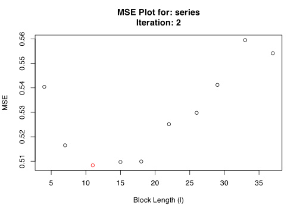

<!-- README.md is generated from README.Rmd. Please edit that file -->

# blocklength

<!-- badges: start -->

[](https://github.com/Alec-Stashevsky/blocklength/actions)
[](https://codecov.io/gh/Alec-Stashevsky/blocklength)

<!-- badges: end -->

Regular bootstrap methods rely on assumptions that observations are
independent and identically distributed (*i.i.d.*), but this assumption
fails for many types of time series because we would expect the
observation in the previous period to have some explanatory power over
the current observation. This could occur in any time series from
unemployment rates, stock prices, biological data, etc. A time series
that is *i.i.d.* would look like white noise, since the following
observation would be totally independent of the previous one (random).

To get around this problem, we can retain some of this *time-dependence*
by breaking-up a time series into a number of blocks with length *l*.
Instead of sampling each observation randomly (with replacement) like a
regular bootstrap, we can resample these *blocks* at random. This way
within each block the time-dependence is preserved.

The problem with the block bootstrap is the high sensitivity to the
choice of block-length, or the number of blocks to break the time series
into.

The goal of `{blocklength}` is to simplify and automate the process of
selecting a block-length to perform a bootstrap on dependent data.
`{blocklength}` has several functions that take their name from the
authors who have proposed them. Currently, there are two methods
available:

1.  `hhj()` takes its name from the [Hall, Horowitz, and
    Jing (1995)](https://academic.oup.com/biomet/article-abstract/82/3/561/260651?redirectedFrom=fulltext)
    method to select the optimal block-length using a cross-validation
    algorithm which minimizes the mean squared error *(MSE)* incurred by
    the bootstrap at various block-lengths.

2.  `pwsd()` takes its name from the [Politis and
    White (2004)](https://doi.org/10.1081/ETC-120028836) Non-parametric
    Plug-in (NPPI) method to automatically select the optimal
    block-length using Spectral Density estimation via “flat-top” lag
    windows of [Politis and Romano
    (1995).](https://doi.org/10.1111/j.1467-9892.1995.tb00223.x)

Under the hood, `hhj()` uses the moving block bootstrap (MBB) procedure
according to [Künsch
(1989)](https://projecteuclid.org/euclid.aos/1176347265) which resamples
blocks from a set of overlapping sub-samples with a fixed block-length.
However, the results of `hhj()` may be generalized to other block
bootstrap procedures such as the *stationary bootstrap* of [Politis and
Romano
(1994).](https://www.tandfonline.com/doi/abs/10.1080/01621459.1994.10476870)

Compared to `pwsd()`, `hhj()` is more computationally intensive as it
relies on iterative resampling processes that optimize the MSE function
over each possible block-length (or a select grid of block-lengths),
while `pwsd()` is a simpler “plug-in” rule that uses auto-correlations,
auto-covariance, and the spectral density of the series to optimize the
choice of block-length.

## Installation

<!-- You can install the released version of blocklength from [CRAN](https://CRAN.R-project.org) with: -->
<!-- ``` r -->
<!-- install.packages("blocklength") -->
<!-- ``` -->

Install the development version from [GitHub](https://github.com) with:

``` r
# install.packages("devtools")
devtools::install_github("Alec-Stashevsky/blocklength")
```

## Upcoming changes

-   change parallel to `{foreach}` (Pending feedback)
-   Build tests
    -   Overlapping subsamples cover entire series

## Example

We want to select the optimal block-length to perform a block bootstrap
on a simulated autoregressive *AR(1)* time series.

First we will generate the time series:

``` r
library(blocklength)
set.seed(32)

# Simulate AR(1) time series
series <- stats::arima.sim(model = list(order = c(1, 0, 0), ar = 0.5),
                           n = 500, rand.gen = rnorm)
```

Now, we can find the optimal block-length to perform a block-bootstrap.
We do this using two methods.

#### 1. The Hall, Horowitz, and Jing (1995) “HHJ” Method

``` r
## Using the HHJ Algorithm with overlapping subsamples of width 10
hhj(series, sub_block_length = 10)
#>  Pilot block length is: 3
#> Registered S3 method overwritten by 'quantmod':
#>   method            from
#>   as.zoo.data.frame zoo
#> Performing minimization may take some time
#> Calculating MSE for each level in subsample: 10 function evaluations required.
#>  Chosen block length: 11  After iteration: 1
```


    #>  Converged at block length (l): 11



    #> $`Optimal Block Length`
    #> [1] 11
    #> 
    #> $`Subsample block size (m)`
    #> [1] 10
    #> 
    #> $`MSE Data`
    #>    Iteration BlockLength       MSE
    #> 1          1           4 0.5428141
    #> 2          1           7 0.5159969
    #> 3          1          11 0.5058036
    #> 4          1          15 0.5101443
    #> 5          1          18 0.5173569
    #> 6          1          22 0.5285706
    #> 7          1          26 0.5307042
    #> 8          1          29 0.5459579
    #> 9          1          33 0.5596887
    #> 10         1          37 0.5536393
    #> 11         2           4 0.5404021
    #> 12         2           7 0.5165052
    #> 13         2          11 0.5083257
    #> 14         2          15 0.5096941
    #> 15         2          18 0.5099022
    #> 16         2          22 0.5251345
    #> 17         2          26 0.5297922
    #> 18         2          29 0.5411978
    #> 19         2          33 0.5595094
    #> 20         2          37 0.5541540
    #> 
    #> $Iterations
    #> [1] 2
    #> 
    #> $Series
    #> [1] "series"
    #> 
    #> $Call
    #> hhj(series = series, sub_block_length = 10)
    #> 
    #> attr(,"class")
    #> [1] "hhj"

#### 2. The Politis and White (2004) Spectral Density Estimation “PWSD” Method

``` r
# Coerce time series to data.frame
data <- data.frame("AR1" = series)

# Using Politis and White (2004) Spectral Density Estimation
pwsd(data) 
```


    #> $BlockLength
    #>     b_Stationary b_Circular
    #> AR1     10.24828   11.73136
    #> 
    #> $Acf
    #> $Acf$AR1
    #> 
    #> Autocorrelations of series 'data[, i]', by lag
    #> 
    #>      0      1      2      3      4      5      6      7      8      9     10 
    #>  1.000  0.550  0.291  0.175  0.107  0.066  0.049  0.010 -0.078 -0.057 -0.071 
    #>     11     12     13     14     15     16     17     18     19     20     21 
    #> -0.081 -0.071 -0.097 -0.073 -0.054 -0.010  0.014 -0.030 -0.042 -0.020 -0.073 
    #>     22     23     24     25     26     27     28 
    #> -0.088 -0.050 -0.058 -0.097 -0.049  0.021  0.078 
    #> 
    #> 
    #> $parameters
    #>        n k        c K_N M_max b_max m_hat M rho.k.critical
    #> [1,] 500 1 1.959964   5    28    68     4 8      0.1439999
    #> 
    #> $Call
    #> pwsd(data = data)
    #> 
    #> attr(,"class")
    #> [1] "pwsd"

We can see that both methods produce similar results for a block-length
of 10-11 depending on the type of bootstrap method used.
